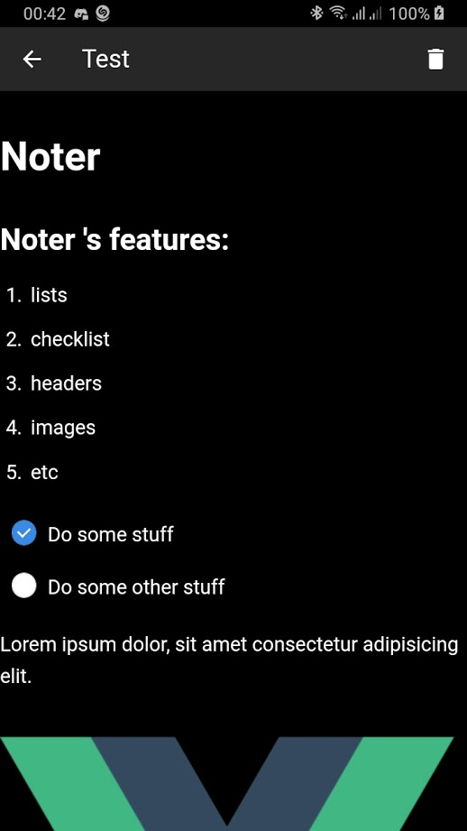

# Noter
Noter is a simple app to write things down.



## Build 
to build this app you need have cordova installed on your machine, and the dependencies of whatever platform you desire to use.

```
# first install all the dependencies
npm install

# then add a platform
cordova platform add android

# lastly build the app
cordova build android
```
